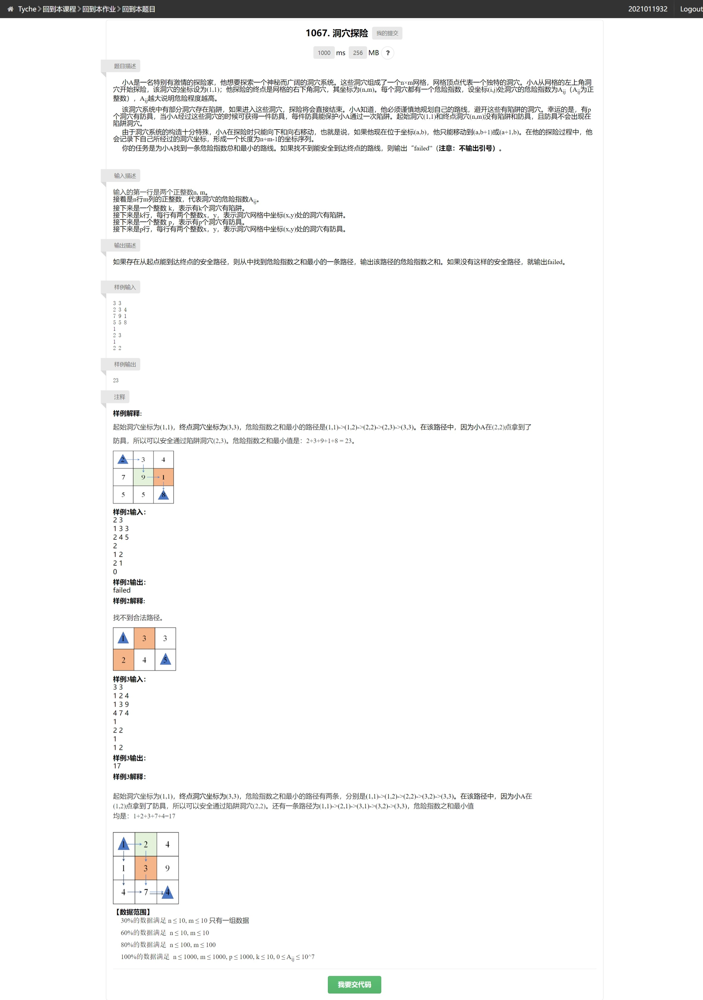

# cave思路



注意虽然护具的数量是1000, 但是洞穴数只有10, 因此要么忽略`p`很高情况下的`dp`维度 (`cave_direct_cut.cpp`), 要么反向从结尾开始计算, 将洞穴看作护具, 将护具看作洞穴 (`cave_reverse.cpp`).

注意选择数量较小的维度, 例如本题直接使用护具数会超时, 因此应使用洞穴数作为上限. 同时注意虽然原始矩阵大小在`int`范围内, 但是`dp`矩阵是累加的, 因此用`unsigned long long`最为保险.

最大值获取方式
```c
unsigned long long max_value = ~0ULL;
long long max_value = ((1ULL << (sizeof(long long) * 8 - 1)) - 1);
```